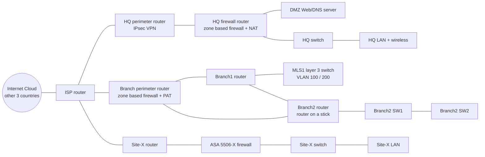

# NWS UK Site: Secure Enterprise Network (Cisco Packet Tracer)

The **United Kingdom site** of a four country enterprise network (Singapore, China, UK, US), built and secured in Cisco Packet Tracer: 13 routers, switches and firewalls across a headquarters, two branches and a new firewalled site, joined to the other countries by site to site IPsec VPN.

Group project of four for the Network Security module, Diploma in Cybersecurity & Digital Forensics, Temasek Polytechnic (February 2025). Each member owned one country. **Everything in this repository is my part: the UK site.**

## Topology

## What I configured

| Area | What is in place | Where |
|---|---|---|
| Site to site VPN | IPsec with IKE policy AES 256, pre shared keys, DH group 5, PFS; one crypto map entry per country (Singapore, US, China) | HQ perimeter router |
| VPN with NAT | NAT exemption ACL so traffic bound for the other countries' LANs goes through the tunnel untranslated | HQ firewall router |
| Zone based firewall | Three zones (INSIDE, OUTSIDE, DMZ) with four zone pairs and inspect policies; outside to inside limited to ICMP | HQ firewall router |
| Zone based firewall | INSIDE and OUTSIDE zones with stateful inspection of outbound traffic | Branch perimeter router |
| ASA firewall | Security levels, dynamic PAT, inbound and outbound ACLs (web, HTTPS, FTP, DNS only), DHCP server, SSH limited to one admin host | Site-X ASA 5506-X |
| NAT | Dynamic pool and a static mapping for the DMZ server at HQ; PAT overload at the branch | HQ firewall, Branch perimeter |
| Routing | OSPF area 0 across the site with MD5 authentication on branch links; default route advertised into the branch | All routers, MLS1 |
| VLANs | VLAN 100/200 on a layer 3 switch with SVIs; VLAN 300/400/99 with router on a stick and 802.1Q trunks (native VLAN 99) | MLS1, Branch2 |
| DHCP | Six pools served centrally with `ip helper-address` relays | Branch perimeter router |
| Switch security | Port security (max 2, sticky MAC), PortFast and BPDU guard on access ports | All switches |
| Device hardening | SSH v2 only, AAA local login, login blocking after failed attempts, minimum password length, encrypted passwords, exec timeouts, login banner | All routers |
| Time and logging | Authenticated NTP and central syslog server | Routers, ASA |

## IP address redesign

The company was expanding, so the UK site needed a new 50 host LAN and addressing that does not overlap with the other three countries.

**New expansion LAN**

| Item | Value |
|---|---|
| Requirement | 50 hosts |
| Smallest block that fits | 2^6 = 64 addresses (62 usable) |
| Network | 172.18.90.0/26 (255.255.255.192) |
| Usable range | 172.18.90.1 to 172.18.90.62 |
| Broadcast | 172.18.90.63 |

A /27 gives only 30 usable hosts, so /26 is the smallest prefix that fits. The block is addressed on the ASA (G1/8) and held ready for the expansion.

**WAN link to the Internet Cloud:** the group split 159.240.0.0/28 into four /30 links, one per country. The UK link is 159.240.0.8/30.

## UK site addressing table

| Segment | Device | Interface | Network | Address |
|---|---|---|---|---|
| HQ outside | HQ perimeter router | G0/0 | 209.165.151.224/29 | 209.165.151.225 |
| | HQ firewall router | G0/0 | | 209.165.151.226 |
| HQ DMZ | HQ firewall router | G0/2 | 172.18.87.192/26 | 172.18.87.193 |
| | DMZ Web/DNS server | NIC | | 172.18.87.194 |
| HQ inside | HQ firewall router | G0/1 | 172.18.80.0/22 | 172.18.80.1 |
| | HQ switch | VLAN 1 | | 172.18.80.2 |
| HQ wireless | HQ wireless router | WLAN | 172.16.0.0/24 | DHCP from .100 |
| Branch1 LAN | MLS1 | VLAN 99 (mgmt) | 172.18.87.128/26 | 172.18.87.129 |
| | MLS1 | SVI VLAN 100 | 172.18.84.0/23 | 172.18.84.1 |
| | MLS1 | SVI VLAN 200 | 172.18.87.0/25 | 172.18.87.1 |
| Branch2 LAN | Branch2 router | G0/1.300 | 172.18.86.0/24 | 172.18.86.1 |
| | Branch2 router | G0/1.400 | 172.18.88.0/26 | 172.18.88.1 |
| | Branch2 router | G0/1.99 | 172.18.88.64/26 | 172.18.88.65 |
| | Branch2 SW1 | VLAN 99 / 300 / 400 | | 172.18.88.66 / 172.18.86.2 / 172.18.88.2 |
| | Branch2 SW2 | VLAN 99 / 300 / 400 | | 172.18.88.67 / 172.18.86.3 / 172.18.88.3 |
| | Admin laptop | NIC | 172.18.88.64/26 | 172.18.88.68 |
| | Internal server | NIC | 172.18.86.0/24 | 172.18.86.4 |
| Branch to Branch1 | Branch router / Branch1 router | G0/0 / G0/0 | 172.18.88.128/30 | .129 / .130 |
| Branch to Branch2 | Branch router / Branch2 router | G0/1 / G0/0 | 172.18.88.132/30 | .133 / .134 |
| Branch1 to Branch2 | Branch1 router / Branch2 router | G0/2 / G0/2 | 172.18.88.136/30 | .137 / .138 |
| Branch1 to MLS1 | Branch1 router / MLS1 | G0/1 / G0/1 | 172.18.88.140/30 | .141 / .142 |
| HQ to ISP | HQ perimeter router / ISP | S0/0/0 | 165.16.151.128/30 | .129 / .130 |
| Branch to local ISP | Branch perimeter router / Local ISP | S0/0/1 | 165.16.151.132/30 | .133 / .134 |
| Local ISP LAN | Local ISP router | Fa0/0 | 165.16.151.0/25 | 165.16.151.1 |
| Site-X to local ISP | Local ISP router / Site-X router | S0/2 / S0/0/0 | 165.16.151.136/30 | .137 / .138 |
| Site-X outside | Site-X router / Site-X firewall | G0/0 / G1/1 | 209.165.151.232/30 | .233 / .234 |
| Site-X inside LAN | Site-X firewall (ASA) | G1/2 | 172.18.89.0/26 | 172.18.89.2 |
| **Site-X expansion LAN (new)** | Site-X firewall (ASA) | G1/8 | **172.18.90.0/26** | 172.18.90.1 |

## Design notes

- Point to point links use /30 so no addresses are wasted.
- User LANs are sized to their host counts with VLSM inside 172.18.80.0/20.
- HQ separates public facing services into a DMZ, so a compromised web server cannot reach the internal LAN directly.
- The new site sits behind a dedicated ASA firewall, separate from the existing branch LANs.

## Files

Running configurations for every UK device are in [`configs/`](configs). Passwords, keys and serial numbers have been removed.

| File | Device |
|---|---|
| `HQ-perimeter-router.cfg` | IPsec VPN, OSPF, NTP |
| `HQ-firewall-router.cfg` | Zone based firewall, NAT, DHCP |
| `BRANCH-perimeter-router.cfg` | Zone based firewall, PAT, DHCP pools |
| `BRANCH1-router.cfg`, `BRANCH2-router.cfg` | OSPF with MD5, router on a stick |
| `BRANCH1-MLS1.cfg` | Layer 3 switching, SVIs, port security |
| `BRANCH2-SW1.cfg`, `BRANCH2-SW2.cfg`, `HQ-switch.cfg` | Trunks, port security, BPDU guard |
| `SiteX-ASA-firewall.cfg`, `SiteX-router.cfg`, `SiteX-switch.cfg` | ASA firewall and Site-X edge |
| `ISP-router.cfg` | Simulated ISP |

## What I would improve

- Move IKE to DH group 14 or higher and IKEv2; group 5 is now considered weak.
- Tighten the zone policies from "all TCP/UDP/ICMP" to the specific applications each zone needs.
- Harden the Site-X edge router and switch to the same standard as the HQ and branch devices.
- Replace pre shared keys with certificates for the VPN peers.

## Skills shown

Site to site IPsec VPN, zone based firewall, Cisco ASA, NAT and PAT, OSPF, VLANs and trunking, VLSM, switch port security, device hardening.
